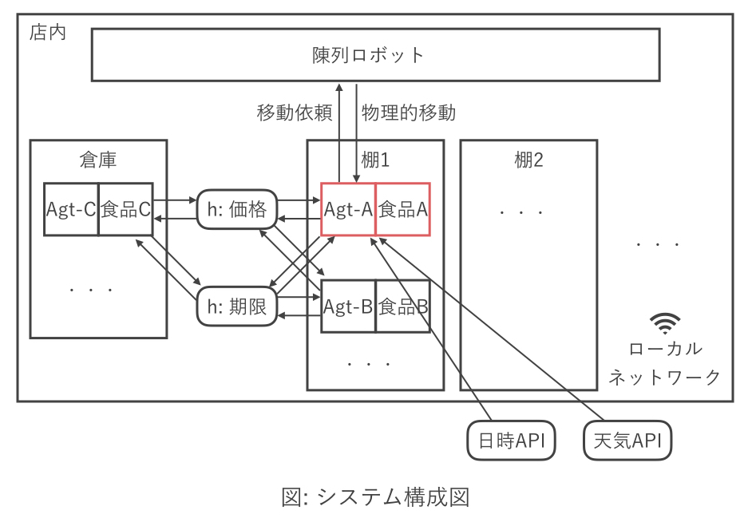
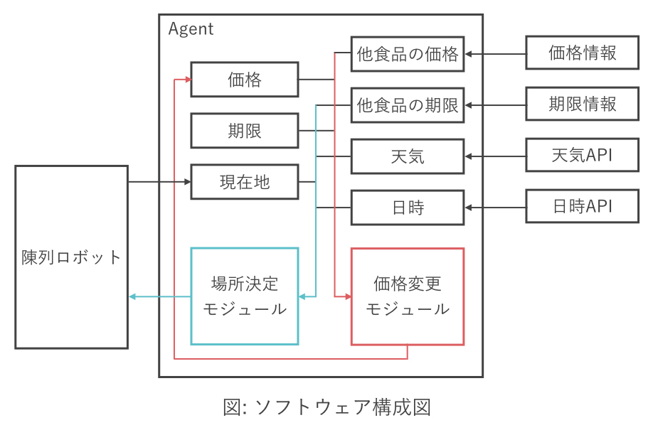

# コンビニ食品における価格と陳列の動的最適化
## Bib
学籍番号: 71645575  
所属: 環境情報学部4年  
名前: 谷村 朋樹

## 概要
食品は店頭に陳列されている商品の中でも，最も販売可能期間が短い．
特に，日本のコンビニエンスストアでは，毎日大量の食品が廃棄物として捨てられている．
食品廃棄物として廃棄される前に売ることができれば，店側の利益にも繋がり，かつ廃棄する食品の量も減らすことができる．
そこで，本稿では自律分散協調型エージェントを用いて，コンビニ食品における価格と陳列の動的最適化を行うシステムを提案する．
本システムでは，各食品に取り付けられたIoTデバイスが食品単体エージェントとなり，他の商品と関係し合いながら，価格や陳列位置(倉庫に戻るも含む)などを設定する．
そして，食品単体エージェントは賞味・消費期限内に高価格で売れることを性能として動作することで，全体として最適な店舗にとって最大利益かつ最小廃棄量を目指す．

## 背景と目的
現在のコンビニエンスストアにおける食品の価格設定は，完全に中央集権的に行われており，販売価格が変動することは稀である．
これらの価格設定は，工場から輸送される費用や利益率，コンビニとしての質の担保などを目的として，緻密に設定されている．
一方で，コンビニエンスストアの食品廃棄物の量は社会問題と課している[1]．
下の資料は，大手コンビニエンスストアにおける食品廃棄料を示している．

1店舗の1日に平均で，約16kgの食品が捨てられていることがわかる．
全店舗の合計では，多い会社で6万トンの食品が廃棄されている．
この問題は，持続可能な社会の実現が世界的に叫ばれている昨今では，重要な課題として解決に向けた取り組みが必要であると考える．

スーパーマーケットの多くは，この問題に対していくつかの取り組みを行っている．
一般的な取り組みとしては，賞味期限や消費期限が近くなった食品を値下げする方法がある．
また，賞味期限や消費期限が近い商品を陳列棚の前に移動させたり等も行われている．
さらに，雨の日は客が少ないことから，雨の日セールを行って多くの商品を買ってもらえるよう取り組んでいるところもある．
これらの値下げは，商品を多く売ることができるため，店舗側の利益にもつながる
一方で，コンビニでは従業員の数や労働環境の観点から，これらの業務を行うことは難しい．

そこで、本稿では、販売可能期間の短い食品を店舗の労働者を頼らずに、可能な限り多くの食品を売るための方法を模索する。

## 提案
上記の目的を達成するために、自律分散強調エージェントを用いて各食品の価格と陳列位置を動的に変化させるシステムを提案する。
本システムで想定している店舗は、現在の人間主導のコンビニエンスストアではなく、ロボットによって陳列等が自動で行われるような、店舗である。
また、各商品には納品された直後IoTデバイスが取り付けられる。
このデバイスが自律分散強調型エージェントとして動作する。

各エージェントは、賞味期限・消費期限内かつ高価格で取り付けられた商品を売ることを目的として行動する。
各エージェントは、同一商品、類似商品等の賞味・消費期限と価格、天気や日時などの情報を環境から受け取ることができる。
また、各エージェントはローカル変数として、自らの価格と賞味・消費期限を保持している。
動作としては、陳列される、倉庫に戻る、陳列される位置を変更する、価格を変更するを想定している。
これらの動作に対して各エージェントは商品の位置を動かす能力はないため、動かす指示をロボット出すことで物理的な移動を行うものとする。
以下に、システム構成図とソフトウェア構成図、仕様を示す。

### システム構成図

### ソフトウェア構成図

### 仕様
#### 性能指標
- 売れる
- 状態良好（賞味期限・消費期限が遠い）
- 高価格である

#### 環境
- 店頭に陳列されている同一商品
- 陳列されていない同一商品
- 同じ品目の商品
- 棚
- 天気
- 日時

#### 動作
- 陳列される
- 倉庫に戻る
- 価格を変更する
- 棚を移動する

#### 知覚・センサ
- 天気API
- 日時API
- 現在地（倉庫か陳列棚か、何処に陳列されているか）
- 同種食品の価格と期限

## 利点と欠点
### 利点
- 可能な限り多くの食品を売ることができ、食品廃棄量を減らすことができ、かつ、利益も上げることができる
- 人間による管理を挟まないことによって、ある店員があとで買うために、意図的に価格設定を行うなどの、弊害をおこすことなく価格変更や陳列位置を決定することができる。現在のコンビニエンスストアなどのシステムにおいて、店舗ごとの価格変更を実施するネックの一つとなっているが、店員の私的操作であることから機械による価格変更等は有用であると考えている。

### 欠点
- 現時点での技術力では実装のコストとハードウェアのコストが高い
本稿では，コンビニエンスストアのような物理的な店舗がロボットによって運営される世界を想定しているため，問題ではないと考えている．
- 食品廃棄問題の根本でもある納品量に関しては考慮することができない

## まとめ
コンビニエンストアにおける食品排気量は社会的に問題されている．
一方で，労働環境や私的搾取等の問題から，自由に価格を値下げして利益をあげるということが難しい．
そのため，中央集権的な管理方法で食品の価格が定められ，売れ残った大量の食品が毎日すてられている．
本稿では，この問題を解決し店舗側の利益を最大化するための自律分散協調型で各食品を管理するエージェントを提案する．
提案するシステムでは，各商品が高額で売れることを目的として，各エージェントが動作することで，全体として利益を高めつつ食品廃棄料を減らすことができる．

## 参考資料
[1] スーパー及びコンビニエンスストアにおける食品廃棄物の発生量，発生抑制等に関する公表情報の概要, https://www.env.go.jp/council/former2013/03haiki/y0314-05/ref01-4.pdf
