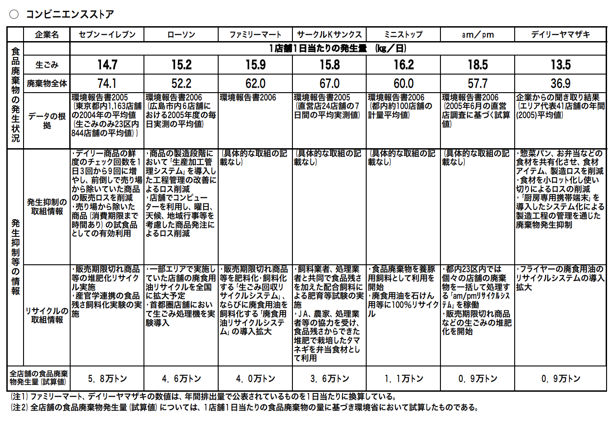

# コンビニ食品における価格と陳列の動的最適化
## Bib
学籍番号: 71645575
名前: 谷村 朋樹

## 概要
食品は店頭に陳列されている商品の中でも，最も販売可能期間が短い．
特に，日本のコンビニエンスストアでは，毎日大量の食品が廃棄物として捨てられている．
食品廃棄物として廃棄される前に売ることができれば，店側の利益にも繋がり，かつ廃棄する食品の量も減らすことができる．
そこで，本稿では自律分散協調型エージェントを用いて，コンビニ食品における価格と陳列の動的最適化を行うシステムを提案する．
本システムでは，各食品に取り付けられたIoTデバイスが食品単体エージェントとなり，他の商品と関係し合いながら，価格や陳列位置(倉庫に戻るも含む)などを設定する．
そして，食品単体エージェントは賞味・消費期限内に高価格で売れることを性能として動作することで，全体として最適な店舗にとって最大利益かつ最小廃棄量を目指す．

## 背景
現在のコンビニエンスストアにおける食品の価格設定は，完全に中央集権的に行われており，販売価格が変動することは稀である．
これらの価格設定は，工場から輸送される費用や利益率，コンビニとしての質の担保などを目的として，緻密に設定されている．
一方で，コンビニエンスストアの食品廃棄物の量は社会問題と課している[1]．
下の資料は，大手コンビニエンスストアにおける食品廃棄料を示している．

1店舗の1日に平均で，約16kgの食品が捨てられていることがわかる．
全店舗の合計では，多い会社で6万トンの食品が廃棄されている．
この問題は，持続可能な社会の実現が世界的に叫ばれている昨今では，重要な課題として解決に向けた取り組みが必要であると考える．

スーパーマーケットの多くは，この問題に対していくつかの取り組みを行っている．
一般的な取り組みとしては，賞味期限や消費期限が近くなった食品を値下げする方法がある．
また，賞味期限や消費期限が近い商品を陳列棚の前に移動させたり等も行われている．
さらに，雨の日は客が少ないことから，雨の日セールを行って多くの商品を買ってもらえるよう取り組んでいるところもある．
これらの値下げは，商品を多く売ることができるため，店舗側の利益にもつながる
一方で，コンビニでは従業員の数や労働環境の観点から，これらの業務を行うことは難しい．

## 目的
本稿では，

## 提案

### システム構成図

### ソフトウェア構成図

### 仕様
#### 性能指標
#### 環境
#### 動作
#### 知覚・センサ

## 利点と欠点

## まとめ

## 参考資料
[1] スーパー及びコンビニエンスストアにおける食品廃棄物の発生量，発生抑制等に関する公表情報の概要, https://www.env.go.jp/council/former2013/03haiki/y0314-05/ref01-4.pdf
